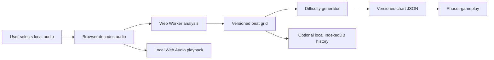

# Rhythm Game Project Deliverables

This document is the delivery contract for every agent working on this repository. Read it before planning, implementing, reviewing, testing, deploying, or documenting a story.

The words **MUST**, **MUST NOT**, **SHOULD**, and **MAY** are requirements. If a story needs to violate this document, the deviation MUST be approved by the user and recorded in that story's `README.md` before implementation continues.

## 1. Product goal

Build a browser-first rhythm game in which a user selects a local music file, the application detects its beats automatically on the user's device, generates a playable chart, and the user presses one button in time with the music.

The first complete release MUST provide:

- A responsive website with keyboard, pointer, and touch controls.
- A precise one-button rhythm game.
- A bundled demonstration song that works without selecting a file.
- Local music selection with clear validation, progress, failure, and retry states.
- Automatic beat and downbeat analysis.
- Automatic Easy, Medium, and Hard one-button charts.
- A preview/correction screen for imperfect analysis.
- Device-specific audio/input calibration.
- Scoring, results, pause, resume, restart, and retry.
- Browser-local processing: selected audio MUST NOT leave the user's device by default.
- Progressive Web App support.
- A demonstrated path to iOS/Android through Capacitor.
- Automated tests, production-preview end-to-end tests, black-box Product Review, Code Review, and evidence for every delivered story.

The initial release does **not** include multiplayer, public song sharing, competitive global leaderboards, licensed music distribution, four-lane chart generation, streaming-service imports, or permanent storage of user audio. These require later product and legal decisions.

## 2. Current decisions and assumptions

Agents MUST use these defaults unless the user changes them:

| Area               | Decision                                                                                                                              |
| ------------------ | ------------------------------------------------------------------------------------------------------------------------------------- |
| Game design        | One universal action: Space, click, or tap. Add multiple buttons only after the one-button game is accepted.                          |
| Web UI             | React, TypeScript, and Vite.                                                                                                          |
| Game renderer      | Phaser owns the real-time canvas. React MUST NOT render per-frame gameplay objects.                                                   |
| Timing             | A dedicated Web Audio API engine. The audio clock is the sole gameplay time source.                                                   |
| Mobile             | PWA first, then Capacitor using the same web build.                                                                                   |
| Runtime            | Static browser application. No server/API is part of the initial release.                                                             |
| Analysis           | Deterministic browser-local DSP in a Web Worker: onset envelope, tempo candidates, beat tracking, downbeat inference, and confidence. |
| Data contract      | Versioned beat-grid and chart JSON shared between the worker, editor, gameplay, and persisted local history.                          |
| Hosting            | No external host is required. Reviews use a production build served on loopback; GitHub Pages is optional convenience hosting.        |
| Music input        | Local file selection and `AudioContext.decodeAudioData`; audio bytes are never uploaded by default.                                   |
| Jobs               | Cancellable Web Worker analysis with progress; completed results may persist in IndexedDB, never raw audio by default.                |
| Retention          | Raw audio remains browser-memory/session-local and is released when replaced, cancelled, or the page closes.                          |
| Accounts           | Guest-first. Accounts are deferred until chart quality and gameplay are validated.                                                    |
| License assumption | The product may become closed-source or commercial. Strong-copyleft or non-commercial dependencies/models require explicit approval.  |

## 3. Architecture boundaries

Use this target monorepo layout. A story MAY introduce a directory only when it first needs it.

```text
apps/
  web/                    React/Vite application and Phaser game
packages/
  chart-schema/           Versioned beat-grid/chart/build contracts
  audio-analysis/         Pure DSP, beat tracking, confidence, and worker protocol
infra/                    Deployment and environment configuration
tests/
  e2e/                    Black-box production-preview Playwright tests
  audio-corpus/           Owned/permissively licensed fixtures and annotations
story/                    Product-visible progress and evidence
quality/
  code-reviews/           Detailed code reports; not Product Review input
docs/
  adr/                    Only durable architecture decisions
```

Required boundaries:

- React owns navigation, forms, status, editor controls, and results.
- Phaser owns gameplay rendering and its animation loop.
- `AudioEngine` owns playback, pause, resume, seek, and conversion between browser event time and song time.
- Gameplay scoring is deterministic domain code testable without React, Phaser, or a real audio device.
- The chart schema is the worker/UI/gameplay contract. Framework-specific objects MUST NOT leak across it.
- Beat detection and chart generation are separate. One beat grid can generate several difficulties without re-analysis.
- UI state and long analysis are separate runtime responsibilities; analysis MUST run in a Web Worker and MUST NOT block rendering/input.
- Browser APIs stay behind small boundaries for audio decoding, worker messaging, IndexedDB, and file selection.
- The analysis core MUST run deterministically against decoded sample data without React or a real audio device.
- Selected audio MUST never be committed, uploaded, logged, persisted by default, or included in story evidence.

Expected production flow:



Static hosting cannot run Python, accept uploads, or execute background jobs. This is an intentional user-approved architecture decision. If browser performance or chart quality later fails measured release thresholds, any server-side analyzer, cloud account, upload, or retention model requires a new user decision and architecture story.

### 3.1 Browser-local beat-recognition design

The first accepted analyzer MUST be a deterministic DSP baseline before any ML model is introduced:

1. Decode with Web Audio after a user selects a file; reject unsupported/corrupt/excessive input explicitly.
2. Downmix channels and resample analysis data to a fixed rate without altering playback audio.
3. Compute overlapping short-time spectra and a log-compressed multi-band spectral-flux onset envelope.
4. Apply local adaptive thresholding and peak picking so quiet passages do not inherit a global threshold.
5. Estimate several tempo candidates with autocorrelation/tempogram scoring across a bounded musical BPM range.
6. Track beat phase with dynamic programming so local onset evidence and tempo continuity both influence the grid.
7. Test half/double-tempo alternatives and infer 3/4 versus 4/4 downbeats from accent/periodicity evidence.
8. Return beats, downbeats, tempo alternatives, confidence components, algorithm version, and warnings—not a silently overconfident grid.

Run steps 2–8 in a Web Worker using transferable buffers. Progress and cancellation occur at deterministic stage boundaries. Output MUST be sorted, finite, within duration, reproducible for the same samples/version, and independent of UI frame rate.

Library/model research boundary:

| Candidate                                                          | Decision for baseline                                                                                                                       |
| ------------------------------------------------------------------ | ------------------------------------------------------------------------------------------------------------------------------------------- |
| Small in-repo FFT or [`fft.js`](https://github.com/indutny/fft.js) | Evaluate in Sprint 04; `fft.js` declares MIT, but dependency need and locked-version license still require review.                          |
| [`Meyda`](https://github.com/meyda/meyda)                          | MIT feature extraction candidate; it does not replace tempo/phase/downbeat tracking and is used only if it reduces tested code/maintenance. |
| [`Essentia.js`](https://github.com/MTG/essentia.js)                | Not permitted by default because the repository declares AGPL-3.0; requires explicit user approval for production use.                      |
| [`ONNX Runtime Web`](https://github.com/microsoft/onnxruntime)     | MIT runtime candidate only after the DSP baseline; every checkpoint has a separate license, size, memory, latency, and quality gate.        |
| Python/PyTorch analyzers such as Beat This! or librosa             | Not part of the browser-only architecture; retain only as private research comparators if they never become runtime requirements.           |

The analyzer selection is evidence-driven. Synthetic and permissively licensed corpus metrics, low-end-device latency/memory, bundle size, failure recovery, and correction effort decide whether a candidate advances. A model is not “better” merely because it is ML-based.

## 4. Delivery model: one vertical story at a time

A sprint means one bounded, user-observable vertical story. The user has explicitly authorized continuous execution through the roadmap: an agent MAY proceed directly to the next sprint after the current story passes every gate and its atomic commit is created, but stories MUST NOT be combined, reviewed together, or committed together.

Every sprint MUST:

1. Begin with one user story and explicit acceptance criteria.
2. Produce the smallest end-to-end behavior satisfying that story.
3. Modify or explicitly verify every relevant layer: frontend, worker/domain logic, shared contract, infrastructure, automated tests, production-preview E2E, security/privacy, and product evidence.
4. Build and serve an immutable production preview on loopback. External hosting is optional.
5. Pass automated CI.
6. Receive an independent black-box Product Review.
7. Receive an independent Code Review.
8. Record progress under `story/<story-id>-<delivered-outcome>/`.
9. End with one atomic accepted commit.

A layer may be `not applicable` only with a concrete explanation in the story `README.md`. “No time” and “future work” are not valid reasons to omit a layer needed by the behavior.

Large horizontal work such as “build the whole analyzer,” “add all UI,” or “set up all tests” is prohibited. Infrastructure work MUST be exposed through a small visible outcome, such as a production-build heartbeat or recoverable analysis job.

## 5. Agent roles and information boundaries

The same agent MUST NOT implement and approve the same story. Product Review and Code Review MUST be performed by different agents.

### 5.1 Delivery Agent

The Delivery Agent:

- Reads this document and the story specification.
- Inspects previous accepted stories and the repository.
- Implements the vertical slice and its tests.
- Builds and serves the production preview through the normal pipeline.
- Causes CI to capture screenshots/video and test summaries.
- Writes the story `README.md` and resolves review findings.
- MUST NOT approve its own product behavior or code quality.
- MUST keep unrelated changes out of the story commit.

### 5.2 Product Reviewer: black-box functional review

The Product Reviewer acts like a product manager with no knowledge of code structure.

The Product Reviewer MAY see only:

- This document's product/acceptance requirements.
- The current story's `README.md`.
- Files under the current story's `evidence/` directory.
- The loopback production-preview URL and visible application.
- Black-box test files or credentials supplied in the review packet.

The Product Reviewer MUST NOT inspect:

- Application/test/configuration source, Git diff, or commit contents.
- CI implementation, server logs, database contents, traces, source maps, DOM inspector, browser source panels, or network payload internals.
- Detailed Code Review output.
- The Vite development server, component harnesses, or any build other than the designated production preview.

The Product Reviewer interacts with the website exactly as a user would and judges visible completeness, clarity, recovery, accessibility at product level, and agreement with acceptance criteria.

If prohibited implementation information is accessed, the review is invalid and MUST be repeated by another agent.

The Product Reviewer writes `story/<story>/PRODUCT_REVIEW.md` with:

- `PASS`, `FAIL`, or `BLOCKED`.
- Preview identifier and review date.
- Every acceptance criterion marked pass/fail with black-box observations.
- User-visible reproduction steps for every failure.
- This attestation: `I did not inspect source code, tests, DOM, network internals, logs, or code-review material.`

### 5.3 Code Reviewer: simplicity and standards

The Code Reviewer MAY see this document, a plain-text story scope, source code, tests, schemas, infrastructure, dependency manifests, Git diff, and automated test output.

The Code Reviewer MUST NOT see or use story screenshots/video, the production preview, or Product Review observations before completing the independent assessment.

The Code Reviewer checks:

- The smallest understandable design was used.
- Names express the rhythm-game domain.
- Functions and modules have one clear responsibility.
- React, Phaser, audio timing, scoring, and analysis boundaries remain clean.
- No premature abstractions, hidden global state, duplicate rules, dead code, or speculative framework exists.
- Error handling is explicit and actionable.
- Security/privacy rules are enforced at file-selection, worker, persistence, and evidence boundaries.
- Tests verify behavior and failure paths without over-mocking internals.
- Dependencies, algorithms, and model licenses are acceptable.
- Changed code is understandable by the next agent without private context.

Detailed findings go in `quality/code-reviews/<story-id>.md`. The story directory records only status and report path so the Product Reviewer receives no code details.

Severity levels:

- `P0`: security, data loss, rights/privacy exposure, or fundamentally broken behavior; blocks delivery.
- `P1`: correctness, timing, contract, or serious maintainability defect; blocks delivery.
- `P2`: meaningful simplicity, readability, test, or robustness issue; blocks unless the user explicitly defers it.
- `P3`: optional improvement; does not block delivery.

### 5.4 Release Coordinator

The Release Coordinator may be the Delivery Agent after both independent reviews. It verifies CI/reviews/evidence, copies only Code Review status into the product record, creates the final sprint commit, and packages the accepted production build. It MUST NOT change product behavior while finalizing acceptance.

## 6. Story directory: the authoritative progress record

Progress is measured from `story/`, not from chat claims, issue comments, branches, or uncommitted code.

Each story MUST use this structure:

```text
story/
  01-short-delivered-outcome/
    README.md
    PRODUCT_REVIEW.md
    TEST_EVIDENCE.md
    DEPLOYMENT.md
    CODE_REVIEW_STATUS.md
    evidence/
      desktop.png
      mobile.png
      demo.webm
      manifest.json
```

Additional evidence is allowed, but these names SHOULD remain stable so progress can be scanned automatically.

### 6.1 Required story `README.md`

Every story `README.md` begins with machine-readable front matter:

```yaml
---
story_id: "01"
title: "User can play the bundled demo song"
status: accepted
sprint: 1
implementation_commit: self
preview_url: "http://127.0.0.1:4173"
staging_url: not_applicable
automated_tests: passed
product_review: passed
code_review: passed
deployed: false
---
```

Allowed `status` values:

- `planned`
- `in_progress`
- `automated_verification`
- `product_review`
- `code_review`
- `accepted`
- `deployed`
- `blocked`

The README MUST also contain:

1. **User story** — `As a ... I want ... so that ...`.
2. **Delivered outcome** — concise visible behavior.
3. **In scope / out of scope**.
4. **Acceptance criteria** — numbered Given/When/Then behavior.
5. **Layer coverage** — frontend, worker/domain, contract, infrastructure, CI/CD, E2E, security/privacy.
6. **Test mapping** — every criterion mapped to automation or a justified black-box review.
7. **Evidence mapping** — criteria mapped to files/video timestamps where useful.
8. **Preview/build** — local production-preview address, build identifier, artifact digest, and optional external URL; never credentials.
9. **Known limitations** — factual and specific.
10. **Review status** — Product Review and Code Review status only.
11. **Rollback** — how to disable/revert the story safely.
12. **Follow-ups** — links only; unfinished required work cannot be disguised as a follow-up.

`implementation_commit: self` means the accepted commit containing the story. It avoids an impossible self-referential SHA.

### 6.2 Evidence rules

Evidence MUST:

- Come from the production build served on loopback or an optional external host, never the Vite development server.
- Demonstrate the real path, not a mocked success path unless the story introduces that mock.
- Include at least one desktop screenshot, one mobile-width screenshot, and a short end-to-end video for UI stories.
- Include failure-state evidence when error handling is part of acceptance.
- Avoid copyrighted/user audio, personal data, tokens, internal URLs, and secrets.
- Be listed in `evidence/manifest.json` with capture time, build identifier, preview type, viewport, scenario, and SHA-256 hash.
- Prefer compressed PNG/WebP and WebM. Video larger than 15 MB MUST use Git LFS or be shortened/compressed.

CI SHOULD capture standard evidence automatically. The Delivery Agent may inspect the application while developing but MUST NOT inspect final review artifacts after capture; only the independent Product Reviewer may use them to grant functional acceptance. The Code Reviewer MUST not inspect them.

### 6.3 Progress calculation

A story counts as:

- **Started** when its directory and `README.md` exist.
- **Implemented** when all required files exist and automated tests pass.
- **Functionally accepted** only when `PRODUCT_REVIEW.md` says `PASS` with the no-code-access attestation.
- **Technically accepted** only when `CODE_REVIEW_STATUS.md` says `PASS` and the detailed report has no unresolved P0-P2 findings.
- **Delivered** when status is `accepted`, CI is green, the accepted build artifact and local-production smoke exist, and the atomic story commit exists. `deployed` is reserved for an optional external publication.

No percentage-complete estimate is allowed inside a story. Its state must be observable from these files.

## 7. Testing strategy

Testing is part of feature design, not cleanup after implementation.

Before code changes, every story MUST define:

- Acceptance criteria.
- Happy path, boundaries, and failures.
- Test data and license/provenance.
- Deterministic behavior that can be automated.
- Perceptual behavior requiring black-box judgment.
- Expected effects on existing regression suites.

Every acceptance criterion maps to at least one automated test unless it is inherently perceptual. Perceptual criteria require production-preview evidence and Product Review.

### 7.1 Required verification layers

CI MUST grow toward and run all applicable layers for every story:

1. **Static** — formatting, lint, types, schema validation, secrets, dependencies, and licenses.
2. **Unit** — scoring, chart generation, time conversion, validation, and pure domain rules.
3. **Component** — React behavior and Phaser adapters with deterministic boundaries.
4. **Contract** — UI, worker messages, persisted records, and charts conform to versioned schemas.
5. **Browser integration** — real worker, IndexedDB, file/audio adapters, and analyzer boundaries where relevant.
6. **Analyzer** — deterministic audio, model invocation, chart invariants, and quality regressions.
7. **Build** — production static web and worker bundles.
8. **Production-preview E2E** — Playwright against the built application served on loopback, never the Vite development server.
9. **Accepted-build smoke** — the packaged static artifact's heartbeat and one critical path.
10. **Black-box Product Review** — designated production-preview behavior and evidence only.

Tests MUST NOT depend on arbitrary sleeps. Use fake clocks, observable completion, or bounded polling. Retries MAY diagnose infrastructure flakiness but MUST NOT turn an application failure into success. A quarantined flaky test needs an owner, reason, and removal story.

### 7.2 Audio timing and scoring

Headless browsers cannot prove physical speaker, display, Bluetooth, or keyboard latency. Timing requires deterministic automation and real-device Product Review.

Automated tests MUST verify:

- Playback/song position is derived from the audio clock.
- Pause, resume, restart, and seek use correct source/offset behavior.
- Browser event timestamps map consistently to song time.
- Hits immediately before, at, and after every judgment boundary receive the correct result.
- Slow/dropped animation frames do not change scoring.
- Keyboard auto-repeat does not add hits.
- Visibility loss pauses or safely reconciles gameplay.
- Calibration applies exactly once and persists at the intended scope.

Real-device Product Review MUST cover available desktop Chrome, Firefox, and Safari plus iOS Safari and Android Chrome before public mobile claims. It may use the loopback production preview or optional external hosting and must exercise keyboard, pointer, touch, built-in output, and at least one Bluetooth path with calibration.

### 7.3 Beat-analysis corpus

Never use unlicensed commercial recordings as repository fixtures.

Use three corpus layers:

1. **Generated synthetic tracks:** several BPM values, non-zero first-beat offsets, silence, 3/4, 4/4, tempo changes, weak accents, syncopation, and half/double-tempo traps.
2. **Owned or permissively licensed musical excerpts:** manually checked beat/downbeat annotations.
3. **Private exploratory corpus:** user-supplied local evaluation only. Commit aggregate metrics, never the audio.

Record:

- Beat F1 with 70 ms tolerance.
- Downbeat F1.
- Correct metrical level/continuity where available.
- Catastrophic failures: empty output, phase shift, persistent half/double tempo, or unusable drift.
- Median/p95 analysis duration, memory, and duration ratio.
- Manual correction operations per minute.

Initial provisional gates:

- Synthetic steady-tempo beat F1 is at least `0.98`.
- No crashes, non-finite/unsorted/out-of-duration events, or impossible note density.
- Low-confidence/catastrophic cases produce recoverable UI instead of silently bad charts.
- Baseline DSP and every proposed browser-capable model are measured on the same corpus before selection.

Real-music release thresholds MUST be set from the analysis spike, not invented. Once accepted, thresholds live in one versioned quality configuration and regressions fail CI.

### 7.4 Chart-generation tests

Generated charts MUST satisfy:

- Notes are sorted, appropriately unique, and inside song duration.
- Minimum spacing and maximum density are respected.
- Easy is not denser than Medium; Medium is not denser than Hard for the same song.
- Same analysis, generator version, and seed reproduce the same chart.
- Analyzer/generator versions are recorded.
- Downbeats/onsets influence selection according to documented rules.
- Pauses, intros, and low-confidence regions do not create floods.
- Generated charts pass the same schema/scoring tests as the demo chart.

Fun is not fully automatable. Product Review judges musical alignment, readability, fairness, useful difficulty separation, and whether errors can be corrected.

### 7.5 Local-file, privacy, and security tests

Test at minimum:

- Supported formats and boundary sizes/durations before and after decode.
- Wrong extension/MIME, truncated/corrupt/empty/oversized/excessive media, archives, and non-audio payloads.
- Worker timeout, cancellation, crash, stale messages, retry, and deterministic replay.
- Raw samples and object URLs are released when replaced, cancelled, completed, or the page closes.
- IndexedDB contains versioned chart/analysis metadata only; raw audio is absent by default.
- Logs/errors/evidence never expose filenames, object URLs, file handles, or audio.
- The static production build makes no application-controlled request that transmits selected audio.

### 7.6 E2E design

E2E tests MUST:

- Run against the story's designated production build served on loopback or its optional external copy.
- Use deterministic owned fixtures.
- Exercise public UI, except for a documented deterministic test clock unavailable in production.
- Cover the story happy path and its most important failure/recovery path.
- Keep trace/video for failed CI; successful product evidence is captured separately.
- Use user-facing roles/labels or explicit test IDs where canvas semantics are impossible.
- Assert user-visible state and worker/persistence outcome, not screenshots alone.

## 8. Black-box functional acceptance

For each story, the Product Reviewer:

1. Reads the user outcome, scope, criteria, and known limitations.
2. Confirms the preview/build identifier matches the evidence manifest.
3. Executes every acceptance scenario on the designated production preview as a user.
4. Tries at least one boundary/failure not demonstrated in the happy-path video.
5. Checks desktop and mobile-width behavior where relevant.
6. Checks discoverability and understandable loading, empty, error, retry, and success states.
7. Uses evidence for consistency, never as a substitute for interaction.
8. Writes `PRODUCT_REVIEW.md` without code terminology.

Suggested Product Reviewer prompt:

```text
You are the independent Product Reviewer. Treat the application as a black box.
You may read only PROJECT_DELIVERABLES.md product requirements, the supplied
story README, its evidence directory, and the designated production preview. Do not inspect
source, tests, Git diff, DOM, browser source/network panels, logs, CI internals,
or Code Review material. Execute every acceptance criterion and at least one
exploratory failure/boundary case. Write PRODUCT_REVIEW.md with PASS, FAIL, or
BLOCKED, user-visible observations for each criterion, reproduction steps for
failures, preview identifier, date, and the required no-code-access attestation.
```

Any visible behavior change after Product Review invalidates the review. Recapture evidence and repeat it. Documentation-only or internal code-only changes may retain functional acceptance only if E2E/smoke rerun and the Release Coordinator records why behavior could not change.

## 9. Code simplicity and standards

The codebase should remain understandable to a new agent in one repository-reading session.

Agents MUST prefer:

- Plain data and small functions over class hierarchies.
- Domain names such as `BeatGrid`, `ChartNote`, `JudgmentWindow`, `SongClock`, and `AnalysisJob` over generic managers/helpers.
- Dependency injection only at real external boundaries: audio clock, file decoding, worker transport, IndexedDB, and analyzer implementation.
- One source of truth for schemas, scoring windows, and difficulty rules.
- Explicit state machines for analysis jobs and gameplay lifecycle.
- Versioned migrations and backward-compatible chart readers.
- Comments explaining timing/audio/domain reasons rather than restating code.
- Deleting unused code instead of preserving speculative hooks.

Agents MUST avoid:

- Reading React state on every Phaser frame.
- Using frame count, `Date.now()`, `setTimeout`, or CSS animation time as song truth.
- Reimplementing scoring separately in React, Phaser, and worker code.
- Spreading browser persistence/audio/worker APIs through domain code.
- Silent fallbacks that hide analysis failure.
- Adding a dependency for a trivial operation.
- Generic service/repository/factory layers without a real substitution need.
- Snapshot-only tests for important behavior.
- Large rewrites inside feature stories without explicit approval.

Suggested Code Reviewer prompt:

```text
You are the independent Code Reviewer. Review the supplied story scope, source
diff, tests, schemas, infrastructure, and automated results. Do not open story
screenshots/video, the production preview, or Product Review observations. Focus
on correctness, timing, privacy/security, simplicity, naming, clear boundaries,
test quality, dependency/model licensing, and readability for the next agent.
Record P0-P3 findings in quality/code-reviews/<story-id>.md. PASS only when no
unresolved P0, P1, or P2 finding remains.
```

## 10. CI/CD and staged verification

### 10.1 Environments

Use four verification stages:

1. **Development** — Vite development server and fast tests; never a source of acceptance evidence.
2. **Candidate preview** — immutable production build served on loopback; source for E2E and evidence.
3. **Accepted artifact** — the same reviewed static files packaged by CI from the atomic story commit.
4. **Optional publication** — GitHub Pages or another static host only when explicitly requested.

No external deployment is required for a sprint. Local browser storage and test fixtures MUST be isolated between development, preview, and automated-test profiles. User-selected audio MUST NOT enter CI artifacts.

### 10.2 Candidate pipeline

Every candidate pipeline MUST eventually perform:

1. Install from lockfiles.
2. Static, secret, license, and dependency checks.
3. Frontend/schema/worker/analyzer tests.
4. Integration tests across worker, browser persistence, and audio boundaries where applicable.
5. Production static build.
6. Schema/storage migration compatibility checks where applicable.
7. Production-preview smoke and E2E while serving the built files on loopback.
8. Automated product-evidence capture from that production preview.
9. Static artifact hashing and publication as a CI artifact.
10. Publish inputs for `TEST_EVIDENCE.md`, `DEPLOYMENT.md`, and `manifest.json`.

Product Review starts only after this pipeline is green.

### 10.3 Acceptance and promotion

After Product and Code Reviews pass:

1. Resolve or explicitly approve every blocking finding.
2. Finalize story records and the detailed Code Review.
3. Create/squash to the atomic story commit.
4. Run verification again on that commit.
5. Package the exact accepted static build as a CI artifact.
6. Run the local-production smoke and critical-path E2E.
7. Mark the story `accepted`; use `deployed` only when optional external hosting is actually performed.

Optional external publication MUST use the already-tested static artifact, never rebuild an unpinned branch.

### 10.4 Rollback and flags

Every story identifies a rollback. Analyzer versions, retention behavior, and chart rules SHOULD have version selectors or local feature flags. IndexedDB migrations remain backward compatible with the previous application until rollback is no longer needed.

## 11. Sprint roadmap

Each numbered item is one default sprint/session and one story directory. Reduce scope rather than combine sprints when a session cannot finish its story.

### Stage A — Delivery runway and playable core

#### Sprint 00 — Production-build heartbeat

**Story:** As a stakeholder, I can open the production preview and see exactly which browser build is ready, so every later story has a verified delivery path without requiring a cloud server.

Deliver:

- Repository structure, lockfiles, baseline chart-schema package, and environment conventions.
- Minimal responsive status screen.
- Generated `build-info.json` contract shown by the screen.
- Production build served on loopback; optional static hosting only if requested.
- CI static checks, frontend/contract smoke tests, production-preview E2E, artifact hashing, and evidence capture.
- Desktop/mobile artifacts.

Do not add game mechanics or audio analysis yet.

#### Sprint 01 — Bundled demo song is playable

**Story:** As a player, I can start a bundled, owned demo song and press one button when notes reach the target.

Deliver:

- Bundled owned demo-song metadata and versioned hand-authored chart.
- Web Audio playback started by a user gesture.
- Phaser note highway, target, countdown, keyboard/click/touch input, and finish state.
- Audio-clock-driven note positions. Detailed scoring is Sprint 02.
- Chart/song-clock unit tests, static-asset contract test, production-preview start-to-finish E2E.
- A short complete-loop video.

#### Sprint 02 — Timing judgment, score, and calibration

**Story:** As a player, I receive fair Perfect/Good/Miss judgments and can calibrate my device.

Deliver:

- Deterministic judgment windows, combo, score, results, retry, pause, resume, and restart.
- Calibration flow and persisted device offset.
- Deterministic result-summary derivation and local persistence without trusting mutable UI totals.
- Fake-clock boundary/dropped-frame tests, persistence validation, and production-preview happy/failure E2E.
- Evidence showing calibration, good play, misses, results, and retry.

### Stage B — User music and automatic analysis

#### Sprint 03 — Private local audio selection

**Story:** As a player, I can select a supported music file, understand validation errors, and prepare it for analysis without uploading it.

Deliver:

- File picker, format/size/duration guidance, decode progress, cancel, error, and retry.
- Browser capability checks and isolated decoding boundary.
- Object-URL/sample-buffer cleanup when the file is replaced, cancelled, or the page closes.
- No raw-audio persistence and no beat model yet; valid files end as `ready_for_analysis`.
- Integration/production-preview E2E for valid, corrupt, unsupported, empty, and oversized files.

#### Sprint 04 — Baseline beat grid

**Story:** As a player, I can have a locally selected song analyzed and preview an automatically detected beat grid.

Deliver:

- Web Worker with channel downmixing, resampling, multi-band spectral-flux onset envelope, adaptive peak picking, autocorrelation/tempogram tempo candidates, and dynamic-programming beat tracking.
- Explicit worker state/progress/cancellation protocol and versioned beat-grid result.
- Progress UI, beat-grid preview, success/failure/retry, and main-thread responsiveness guard.
- Raw sample buffers released after analysis unless currently needed for local playback.
- Synthetic corpus, beat metrics, deterministic worker integration tests, performance budget, and production-preview E2E with an owned fixture.

#### Sprint 05 — High-quality beats, downbeats, and confidence

**Story:** As a player, I receive a better beat grid with downbeats and an honest warning when analysis is uncertain.

Deliver:

- Improved DSP variants and any permissively licensed browser-capable model benchmarked against the same corpus.
- Selected algorithm/version behind a small pure analysis interface; WebAssembly/ONNX is allowed only after license, bundle, memory, and device-performance review.
- Beats, downbeats, confidence signals where available, tempo alternatives, and failure classification.
- Agreement and fallback comparison against the accepted browser DSP baseline.
- UI distinction for beats/downbeats, low confidence, and half/double-tempo ambiguity.
- Quality thresholds, performance measurements, model/license inventory, and regression CI.

This story passes on demonstrated quality, not merely successful model execution.

#### Sprint 06 — Automatic playable difficulties

**Story:** As a player, I can choose Easy, Medium, or Hard and play an automatically generated one-button chart for my selected song.

Deliver:

- Deterministic generator combining beat/downbeat grid and onset salience.
- Density, spacing, intro/silence, confidence, and impossible-pattern guards.
- Schema containing analyzer/generator versions.
- Difficulty picker and complete select-to-play path.
- Invariant/difficulty/golden tests, full production-preview E2E, and evidence for all difficulties.

### Stage C — Correction, resilience, and usable beta

#### Sprint 07 — Correct an imperfect chart

**Story:** As a player, I can correct common automatic-analysis errors without understanding the algorithms.

Deliver:

- Controls for global offset, half/double tempo, first downbeat, tap tempo/phase, beat add/remove, reset, and undo.
- Persisted versioned edits separate from original model output.
- Regeneration of every difficulty from corrected analysis.
- Edit determinism, undo/reset, migration, save/reload, and production-preview correction-to-play tests.
- Product Review with deliberately wrong fixture output.

#### Sprint 08 — Leave, return, recover, and retry

**Story:** As a player, I can cancel or recover from local analysis failure and understand when a file must be selected again.

Deliver:

- Explicit worker state machine with bounded retry, cancellation, timeout, and stale-message rejection.
- Completed beat grids checkpointed in IndexedDB; in-progress audio is intentionally not persisted.
- Refresh/reopen UI explains whether a chart can resume or the local file must be reselected.
- Worker crash/timeout/duplicate/stale/cancellation and cleanup tests.
- Production-preview E2E starting analysis, cancelling, retrying, reloading, and recovering a completed grid.

#### Sprint 09 — Results and chart-only history

**Story:** As a returning player, I can see recent charts/results without the application retaining my music.

Deliver:

- Local-first history with chart metadata, score, versions, and retention explanation.
- Versioned IndexedDB chart/result persistence with deterministic validation on read.
- Re-select-local-file flow when playback audio is absent.
- Clear/delete history behavior.
- Privacy, retention, migration, corruption-recovery, and production-preview E2E tests.

Do not add permanent audio storage or public sharing.

#### Sprint 10 — Responsive, accessible PWA

**Story:** As a desktop or mobile-web player, I can install and operate the game with understandable controls and accessibility settings.

Deliver:

- Installable PWA shell; offline bundled demo only.
- Responsive file selection, editor, game, and results.
- Reduced motion, remappable primary key where practical, visible focus, semantic non-canvas controls, contrast, and non-color-only judgments.
- Capability/unsupported-browser messaging and safe updates.
- Accessibility, viewport, PWA, browser E2E, and real-device Product Review.

Local analysis MAY work offline only after required worker/model assets are cached and verified; capability messaging must be truthful.

### Stage D — Hardening and mobile path

#### Sprint 11 — Public beta hardening

**Story:** As a beta user, I receive predictable performance and safe failure behavior under load and malicious input.

Deliver:

- File/sample-duration limits, worker memory/time budgets, malformed-input isolation, dependency scans, and safe errors.
- Opt-in local diagnostics without audio/filename leakage; no telemetry is added without user approval.
- Analysis-duration/memory measurements and visible recovery for resource exhaustion.
- Repeated-analysis soak tests, malformed-media corpus, low-end-device profiling, game-frame profiling, and rollback drill.
- Local-data deletion/export procedure and troubleshooting runbook.

#### Sprint 12 — Capacitor mobile build

**Story:** As a mobile tester, I can install the same game as an iOS/Android app and complete demo/local-file flows.

Deliver:

- Capacitor projects generated from the accepted web build.
- Native file selection/lifecycle handling only where WebView behavior is insufficient.
- Real-device latency/calibration comparison with mobile web.
- Written decision whether Web Audio is adequate or a narrow native bridge is needed.
- Automated build checks and device evidence. Do not claim store support without signed-store validation.

#### Sprint 13 — Production release

**Story:** As a public user, I can access a stable documented release with privacy information and rollback.

Deliver:

**This sprint is optional unless the user requests external publication.**

- Optional GitHub Pages/custom-domain publication, CSP/security policy, privacy/local-retention explanation, music-rights confirmation, support path, and version display.
- Published-site smoke/E2E using owned fixtures, or accepted-artifact smoke if the release remains local-only.
- Export/import or reproducibility plan for locally stored charts/metadata.
- Rollback/flag drill.
- Final black-box regression across accepted stories.
- Release notes linked to every delivered story directory.

Store submission, accounts, sharing, multiplayer, and multi-lane generation remain later stories unless explicitly added.

## 12. Definition of Done

A sprint is not done until every applicable item is true:

- [ ] The story is small, vertical, and user-observable.
- [ ] Scope and Given/When/Then criteria were written before code.
- [ ] Frontend, worker/domain, contract, infrastructure, and security effects are implemented or explicitly verified.
- [ ] Unit, component, contract, integration, analyzer, and build tests pass as applicable.
- [ ] The immutable production build is served as the designated loopback preview.
- [ ] E2E passes against that preview.
- [ ] Evidence comes from that preview and contains no private/copyrighted data.
- [ ] Product Reviewer passed without accessing implementation information.
- [ ] Code Reviewer passed without seeing product artifacts/site.
- [ ] No unresolved P0, P1, or P2 exists.
- [ ] Story directory is complete and truthful.
- [ ] Rollback is documented/tested in proportion to risk.
- [ ] The atomic accepted commit is created.
- [ ] The final commit passes CI and packages the accepted static artifact.
- [ ] Accepted-artifact smoke tests pass.
- [ ] Story status is `accepted` (`deployed` only for optional external publication).

The Vite development server, deferred tests, screenshots without production-build E2E, or one review without the other do not satisfy Done. A deliberately served local production build is valid acceptance evidence.

## 13. Commit policy

Every sprint MUST end with an atomic commit containing its implementation, tests, configuration, story record, and evidence.

- One story per final commit.
- Suggested subject: `story(06): generate playable chart difficulties`.
- Temporary work-branch commits MAY exist but SHOULD be squashed before promotion.
- Review fixes belong in the same final story commit. Behavior changes require repeated Product Review.
- Do not mix unrelated cleanup, upgrades, or future scaffolding.
- Never commit secrets, selected/private music, caches, or downloaded models without explicit license approval.
- Large accepted video evidence uses Git LFS.
- Never commit merely to make an incomplete sprint appear delivered.
- After the commit, CI rebuilds/verifies and packages the static artifact from that exact commit.
- `implementation_commit: self` resolves to the final story commit.

## 14. Change control and questions

Ask the user before choices changing product scope, privacy, rights, cost class, or core architecture, including:

- Retaining or publicly sharing selected music.
- Accounts, payments, advertising, leaderboards, or multiplayer.
- Adding server-side analysis, uploads, cloud services, or transmission of selected music.
- AGPL/GPL/non-commercial/unclear production dependencies or models.
- Replacing the web-first stack or adding native audio.
- Purchasing hosting, always-on, or GPU infrastructure.
- Streaming-service URLs or DRM media.
- Multiple lanes/buttons.
- Weakening deletion, security, reviewer separation, evidence, or tests.

Proceed with Section 2 defaults for ordinary implementation details. Questions should be specific, explain impact, and recommend one option.

Open decisions that do not block Sprint 00:

1. Maximum local file size/duration. Default proposal: 25 MB and 10 minutes, refined by browser memory benchmarks.
2. Mandatory launch devices. Default: current Chrome, Firefox, Safari, iOS Safari, and Android Chrome.
3. Local chart/history retention. Default: versioned chart/result metadata may persist in IndexedDB; raw audio never persists.
4. Optional external publication. Default: no external deployment; GitHub Pages may be added when requested.
5. Closed-source/commercial intent. Until answered, choose dependencies safe for that possibility.

Until answered, no agent may broaden retention, licensing, sharing, or cost.
